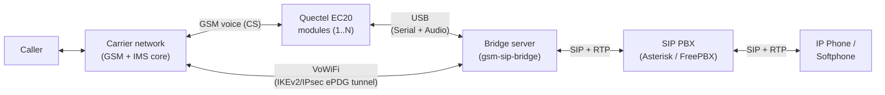

# GSM-SIP Bridge

Bridge incoming cellular calls to a SIP extension over VoIP. When someone
dials the GSM number, the system auto-answers and routes audio
bidirectionally to a SIP/PBX destination — whether the carrier delivers
the call over the circuit-switched network (via Quectel EC20 modules) or
over VoWiFi/IMS (via a built-in ePDG tunnel). Supports multiple EC20
modules simultaneously. Incoming SMS messages are persisted to a local
database and optionally forwarded to Discord.

**Language**: Rust | **Platform**: Linux (amd64, arm64) | **Releases**: [RELEASE_NOTES.md](RELEASE_NOTES.md)

## Highlights

- **GSM-to-SIP call bridging** — auto-answers incoming GSM calls on EC20 modules and bridges audio to a SIP extension, with comfort ringback while the extension rings.
- **VoWiFi-to-SIP bridging** — answers calls the carrier delivers over Wi-Fi Calling: an IKEv2/IPsec ePDG tunnel (strongSwan), IMS-AKA registration with Gm IPsec, and wideband (AMR-WB → G.722) audio end-to-end. Optional; disabled by default.
- **Multi-module support** — auto-detects all connected EC20s, assigns stable IMEI-keyed slots that survive restarts and re-plugs, and handles concurrent calls independently.
- **Self-healing** — detects USB disconnects and network registration loss, recovers each card independently with exponential backoff, and runs a preventive scheduled nightly modem restart cycle.
- **DID passthrough** — forwards the GSM caller's number as the SIP DID (`P-Asserted-Identity`, `X-GSM-Caller-ID`), so PBX inbound routes decide the destination.
- **CLI card management** — `card list` / `restart` / `set-mode` / `get-mode` against the running daemon over a Unix socket, with persisted per-slot network mode preferences (`2g`/`3g`/`4g`/`auto`).
- **SMS capture** — persists all incoming SMS to SQLite and posts rich-embed notifications to a Discord webhook.
- **Call logging** — every incoming call recorded with caller ID, module, duration, and outcome.
- **Observability** — Prometheus metrics endpoint and a pre-provisioned Grafana dashboard.
- **Tunable audio pipeline** — `lan`/`wan` latency profiles, ALSA buffer and jitter-buffer controls, modem gain/echo-canceller settings, real-time thread scheduling.
- **Memory safety** — zero `unsafe` in the application binary; all FFI confined to the `pjsua-sys`/`pjsua-safe` crates with documented invariants.

## How it works



The carrier decides how a given call is delivered: over the
circuit-switched network to an EC20 module, or over VoWiFi through the
ePDG tunnel. Either way it ends up as a SIP call to your PBX. See
[docs/architecture.md](docs/architecture.md) for the crate layout, both
call flows in detail, and the audio pipeline.

## Quick Start (Docker Compose)

Requires Docker with the Compose plugin and one or more Quectel EC20 USB
modems. **First time?** Each module needs one-time preparation (enable USB
audio, disable ModemManager) — see
[docs/hardware-setup.md](docs/hardware-setup.md).

```bash
git clone <repo-url> && cd gsm-sip-bridge/docker
cp ../config.toml.example config.toml   # edit with your SIP/PBX details
cat > .env <<EOF
SIP_PASSWORD=yourpassword
DISCORD_WEBHOOK_URL=https://discord.com/api/webhooks/...
EOF
docker compose up -d
```

This starts the full stack:

| Service | URL | Purpose |
|---|---|---|
| gsm-sip-bridge | `http://localhost:9091/metrics` | Bridge + metrics endpoint |
| Prometheus | `http://localhost:9090` | Metrics collection and querying |
| Grafana | `http://localhost:3000` | Dashboards (admin/admin) |
| sqlite-web | `http://localhost:8088` | Browse call and SMS database (read-only) |

The container runs `privileged` with `/dev` bind-mounted, to access USB
devices and ALSA audio. It also defaults to `network_mode: host` for the
SIP/RTP media path — that part is independent of device access. To update
later:

```bash
docker compose pull && docker compose up -d
```

## Configuration

A single TOML file (see `config.toml.example`). The minimum that matters:

```toml
[sip]
server = "pbx.example.com"
username = "bridge-account"
password = "env:SIP_PASSWORD"    # secrets support env:VAR_NAME syntax

[bridge]
# sip_destination = "599"        # empty = route by caller DID via PBX inbound rules

[sms]
discord_webhook_url = "env:DISCORD_WEBHOOK_URL"

[vowifi]
enabled = false                  # opt-in Wi-Fi Calling bridge — see docs
```

Every section and key — including audio tuning (`[audio]`), card recovery
(`[resilience]`), the scheduled restart cycle (`[scheduled_restart]`), and
the full `[vowifi]` reference — is documented in
[docs/configuration.md](docs/configuration.md).

## Documentation

| | |
|---|---|
| **Getting started** | [Hardware setup](docs/hardware-setup.md) · [Configuration reference](docs/configuration.md) |
| **Running it** | [Operations runbook & troubleshooting](docs/operations.md) · [Metrics & dashboards](docs/observability.md) |
| **Going deeper** | [Architecture & call flows](docs/architecture.md) · [VoWiFi bridge design](docs/vowifi-bridge.md) · [EC20 VoLTE setup](docs/ec20-volte-setup.md) |
| **Contributing / upgrading** | [Building from source](docs/development.md) · [Migrating from v4.1.x](docs/migrating-from-v4.1.x.md) |

The full index, including design notes and engineering history, is at
[docs/README.md](docs/README.md).

## Building from Source

```bash
sudo apt install build-essential pkg-config clang libclang-dev \
  libasound2-dev libusb-1.0-0-dev libpjproject-dev uuid-dev libssl-dev
cp config.toml.example config.toml
export SIP_PASSWORD=yourpassword
make build && make test && make run
```

Details, Makefile targets, and the pre-commit checklist:
[docs/development.md](docs/development.md).

## Troubleshooting

Common issues — no `ttyUSB` devices, missing audio device, SIP
registration failures, choppy audio, cards stuck in recovery — are covered
in the runbook: [docs/operations.md](docs/operations.md#troubleshooting).

## Acknowledgements

The VoWiFi bridge stands on foundation work by the
[Osmocom](https://osmocom.org/) project — their
[VoWiFi with Asterisk](https://osmocom.org/projects/foss-ims-client/wiki/VoWiFi_with_Asterisk)
research (the foss-ims-client wiki), the `strongswan-epdg` fork, and
sysmocom's VoLTE/Gm-IPsec Asterisk patches mapped out the ePDG tunnel,
IMS-AKA, and Gm IPsec territory this project builds on. Thank you.
