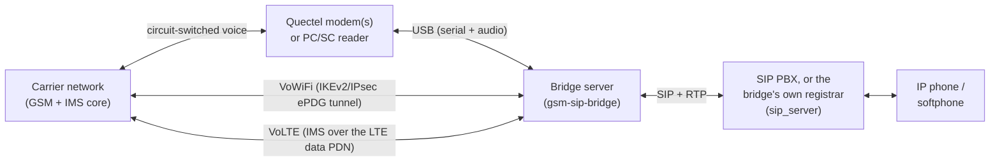

# GSM-SIP Bridge

Bridges cellular calls to SIP/VoIP in both directions.

**Inbound**: the bridge answers a call placed to the SIM's number and connects
the audio to a SIP destination. The call can arrive circuit-switched over a
Quectel modem, over VoWiFi through a built-in ePDG tunnel, or over VoLTE
through the bridge's own IMS registration on the LTE data PDN.

**Outbound** (opt-in): a PBX, or an IP phone registered to the bridge, dials out
through the first idle line on any of those three paths.

VoWiFi and VoLTE support several SIMs at once, one line per SIM.

**Language**: Rust | **Platform**: Linux (amd64, arm64) | **Releases**: [RELEASE_NOTES.md](RELEASE_NOTES.md)

> ⚠️ **Educational and personal/hobbyist use only.** Bridging cellular calls to
> VoIP is regulated in most countries and may breach your carrier's terms. Read
> the [full disclaimer](#disclaimer) first.

## Features

### Calls

- Inbound calls are answered automatically on all three paths. The caller hears
  ringback while the SIP side rings.
- Outbound calling is off by default (`[outbound].enabled`). A PBX INVITE, or an
  INVITE from a phone registered to the bridge, is placed on the first idle
  line. There is no dial plan and no allow-list; the destination is dialed as
  given. See [docs/architecture.md](docs/architecture.md#outbound-calling).
- An inbound call carries the receiving line's own number to the SIP side: as
  `P-Called-Party-ID` in SIP server mode, or as the Request-URI when
  `[bridge].sip_destination` is empty. The caller's number is sent separately in
  `P-Asserted-Identity` and `X-GSM-Caller-ID`.

### Call paths

- **Circuit-switched**: GSM voice over a Quectel EC20's USB serial and USB audio
  interfaces. `[cs].enabled = false` disables the path and its modem probing.
- **VoWiFi**: IKEv2/IPsec ePDG tunnel (strongSwan), IMS-AKA registration, Gm
  IPsec. AMR-WB to G.722, wideband end to end. Discovers every VoWiFi-capable
  SIM and runs one tunnel and registration per line. Off by default.
- **VoLTE**: the bridge runs its own IMS registration over the modem's LTE data
  PDN instead of using the modem's internal voice stack. One line per modem,
  each in its own network namespace. Off by default.

### Hardware

| Device | Circuit-switched | VoWiFi | VoLTE |
|---|---|---|---|
| Quectel EC20 | yes | yes | yes |
| Quectel EC200 / EC200U | no (no audio output) | yes | yes |
| PC/SC card reader (e.g. OmniKey AG 3x21) | no | yes | no |

A card reader holds the SIM with no modem present; the SIM reaches the carrier
over the host's own network. See
[docs/supported-hardware.md](docs/supported-hardware.md) and
[docs/omnikey-pcsc-vowifi.md](docs/omnikey-pcsc-vowifi.md).

### IMS/SIP stack

The bridge implements SIP, SDP, RTP and the 3GPP SMS layers itself instead of
re-bridging audio the modem has already decoded.

- Decodes and re-encodes carrier media: AMR-NB and AMR-WB, RFC 4867 framing,
  both octet-aligned and bandwidth-efficient. Most carriers offer no G.711.
- SDP: direction attributes and per-media sections are answered as offered.
  Offerless INVITEs, locally-confirmable QoS preconditions (RFC 3312) and
  RFC 4028 session timers are supported.
- RTCP per RFC 3550 on the carrier leg. Carrier-reported loss, jitter and
  round-trip are logged per call and exported as metrics.
- DTMF (RFC 4733) is forwarded across transcoding, and re-stamped when the two
  legs negotiate different payload types.
- SMS over IMS per TS 23.040 and TS 24.011, including the TS 24.341 delivery
  report (RP-ACK) that some carriers require before they deliver messages.
- In-dialog requests are matched against the call they name.

### SMS, alerts and storage

- Incoming SMS is read on all three paths, both over the IMS registration and by
  sweeping the modem's own storage. Both routes share one PDU decoder,
  duplicates are suppressed, and multi-part messages are reassembled. The bridge
  does not send SMS.
- SQLite store: calls (caller ID, line, duration, outcome), SMS, card slots and
  per-slot network mode. sqlite-web is included for read-only browsing.
- Discord webhooks: SMS as embeds, plus alerts for module/SIM lifecycle,
  registration loss, tunnel failure, missed calls, line discovery failure and Gm
  connection loss. Each has its own enable flag, threshold and webhook override,
  and sends a recovery notice when the condition clears.
- Prometheus metrics endpoint and a Grafana dashboard. See
  [docs/observability.md](docs/observability.md).

### Operation

- Recovery: USB disconnects and registration loss are handled per card with
  exponential backoff. Modem commands have deadlines, and a watchdog restarts a
  line that stops making progress. A nightly restart cycle runs by default. A
  serial port that hangs the kernel driver is quarantined after three timeouts.
- SIP side: register to a PBX as a trunk, or set `[sip_server].enabled` and have
  phones register to the bridge directly.
- Control CLI over a Unix socket: `card list`, `card restart`, `card set-mode`,
  `card get-mode`. The per-slot mode (`2g`/`3g`/`4g`/`auto`) persists across
  restarts. `vowifi-status` and `volte-status` report line health.
- Audio tuning: `lan`/`wan` latency profiles, ALSA and jitter buffer sizes,
  modem gain, echo canceller, SCHED_FIFO thread priority.
- No `unsafe` in the application binary. FFI is confined to the
  `pjsua-sys`/`pjsua-safe` and `amr-sys`/`amr-safe` crates.

## How it works


```mermaid
flowchart LR
    Carrier["Carrier network<br/>(GSM + IMS core)"]
    Modem["Quectel modem(s)<br/>or PC/SC reader"]
    Server["Bridge server<br/>(gsm-sip-bridge)"]
    SIP["SIP PBX, or the<br/>bridge's own registrar<br/>(sip_server)"]
    Phone["IP phone /<br/>softphone"]

    Carrier <-->|"circuit-switched voice"| Modem
    Modem <-->|"USB (serial + audio)"| Server
    Carrier <-->|"VoWiFi (IKEv2/IPsec ePDG tunnel)"| Server
    Carrier <-->|"VoLTE (IMS over the LTE data PDN)"| Server
    Server <-->|"SIP + RTP"| SIP
    SIP <--> Phone
```

The carrier decides which path delivers a given call. A trunk holds a single
binding, so only one component may own the SIP registration: the
circuit-switched daemon normally, or the VoWiFi/VoLTE telephony agent when
either of those is enabled.

Outbound calls originate in two ways: a PBX INVITE to the trunk, or an INVITE
from a registered phone, which the registrar redirects (302) to the dial-out
port. Both are placed on the first idle line in that process's own pool.

There are two SIP-side topologies, and either works with any call path:

- **PBX trunk** (default). The bridge registers to an external PBX, whose
  inbound routes pick the destination.
- **SIP server** (`[sip_server].enabled`). Phones REGISTER to the bridge and it
  rings the configured account. No PBX is needed.

With VoWiFi or VoLTE enabled the bridge runs as several processes: one
carrier-facing agent per line in its own network namespace, one telephony-side
process holding the PBX registration, and a supervisor that builds the
namespaces and veth pairs and tears them down on exit.

See [docs/architecture.md](docs/architecture.md) for the crate layout, the three
call flows, the audio pipeline and outbound line selection.

## Quick start (Docker Compose)

Requires Docker with the Compose plugin and at least one supported modem or card
reader. A modem needs one-time setup first (enable USB audio, disable
ModemManager): see [docs/supported-hardware.md](docs/supported-hardware.md).

```bash
git clone <repo-url> && cd gsm-sip-bridge/docker
cp ../config.toml.example config.toml   # edit with your SIP/PBX details
cat > .env <<EOF
SIP_PASSWORD=yourpassword
DISCORD_WEBHOOK_URL=https://discord.com/api/webhooks/...
EOF
docker compose up -d
```

This starts the full stack:

| Service | URL | Purpose |
|---|---|---|
| gsm-sip-bridge | `http://localhost:9091/metrics` | Bridge + metrics endpoint |
| Prometheus | `http://localhost:9090` | Metrics collection and querying |
| Grafana | `http://localhost:3000` | Dashboards (admin/admin) |
| sqlite-web | `http://localhost:8088` | Browse call and SMS database (read-only) |

The container runs `privileged` with `/dev` bind-mounted, for USB device and
ALSA access. It defaults to `network_mode: host` for the SIP/RTP media path.
Update with `docker compose pull && docker compose up -d`.

### Image variants

| Variant | Tags | Contains | Use when |
|---|---|---|---|
| slim (default) | `:<version>`, `:latest` | strongSwan VoWiFi engine only | Almost always: the default `[vowifi].tunnel_engine = "strongswan"` path |
| full (on demand) | `:<version>-swu` | strongSwan plus the legacy SWu/Python engine | Only if you must run `[vowifi].tunnel_engine = "swu"` |

The slim image omits the Python interpreter and the vendored SWu-IKEv2 dialer,
saving about 72 MB. Configuring the `swu` engine on it aborts at startup with a
message naming the `-swu` image. The full image is published on demand, not on
every release. Build either locally with `make docker-build` or
`make docker-build-swu`.

## Configuration

A single TOML file; see `config.toml.example`. Parsing is strict, so an unknown
key aborts startup and names the offending key. The minimum:

```toml
[sip]
server = "pbx.example.com"
username = "bridge-account"
password = "env:SIP_PASSWORD"    # secrets support env:VAR_NAME syntax

[bridge]
# sip_destination = "599"        # empty = route by the line's own number via PBX inbound rules

[sms]
discord_webhook_url = "env:DISCORD_WEBHOOK_URL"

[vowifi]
enabled = false                  # opt-in VoWiFi bridge
[volte]
enabled = false                  # opt-in host-side VoLTE bridge
[outbound]
enabled = false                  # opt-in dial-out over the mobile network
```

[docs/configuration.md](docs/configuration.md) documents every section and key,
including audio tuning (`[audio]`, `[modem_audio]`), card recovery
(`[resilience]`), port discovery (`[discovery]`), the restart cycle
(`[scheduled_restart]`), the alert categories, and the full
`[vowifi]`/`[volte]`/`[sip_server]` reference.

[`sample_configs/`](sample_configs/README.md) has a ready-to-copy config per
deployment shape, plus notification snippets to merge into any of them.

## Documentation

| | |
|---|---|
| **Getting started** | [Supported hardware & setup](docs/supported-hardware.md) · [Configuration reference](docs/configuration.md) · [Sample configs](sample_configs/README.md) |
| **Running it** | [Operations runbook & troubleshooting](docs/operations.md#troubleshooting) · [Metrics & dashboards](docs/observability.md) |
| **Going deeper** | [Architecture & call flows](docs/architecture.md) · [VoWiFi bridge design](docs/vowifi-bridge.md) · [PC/SC card-reader VoWiFi lines](docs/omnikey-pcsc-vowifi.md) · [Host-side VoLTE operations](docs/operations.md#host-side-ims-over-lte-volte) · [EC20 VoLTE setup (modem-internal, legacy)](docs/ec20-volte-setup.md) |
| **Contributing / upgrading** | [Building from source](docs/development.md) · [Migrating from v4.1.x](docs/migrating-from-v4.1.x.md) · [Config migrations](docs/migrating-config-reorg.md) |

The runbook's [troubleshooting section](docs/operations.md#troubleshooting)
covers missing `ttyUSB` devices, a missing audio device, SIP registration
failures, choppy audio and cards stuck in recovery.

[docs/README.md](docs/README.md) is the full index, including design notes.
`docs/` is mirrored to this repository's GitHub wiki on every push to `main`.

## Building from Source

```bash
sudo apt install build-essential pkg-config clang libclang-dev \
  libasound2-dev libusb-1.0-0-dev libpjproject-dev uuid-dev libssl-dev
cp config.toml.example config.toml
export SIP_PASSWORD=yourpassword
make build && make test && make run
```

Details, Makefile targets, and the pre-commit checklist:
[docs/development.md](docs/development.md).

<a id="disclaimer"></a>

## ⚠️ Disclaimer

**This project is for educational and personal/hobbyist purposes only.**
It is not intended for, and must not be used in, any commercial product,
service, or deployment.

Bridging cellular calls (GSM, VoWiFi, VoLTE) to SIP/VoIP can be subject to
telecom regulations, spectrum/interconnection rules, and your cellular
provider's terms of service — including restrictions on unlicensed GSM
gateways / "SIM boxes" and call-traffic bypass, which are illegal in many
countries. **Before using this software, check your local laws and your
cellular provider's terms and conditions** to confirm your intended use is
permitted. Running multiple SIMs through a single automated system can
also trigger a carrier's anti-fraud detection even for personal use,
independent of the legal question.

**You use this software entirely at your own risk.** It is provided "AS
IS", without warranty of any kind, express or implied (see
[LICENSE](LICENSE)). The author and contributors are not responsible for
any damage, loss, fines, service or account termination, legal liability,
or other harm arising from its use, misuse, or inability to use.

This project is not affiliated with, endorsed by, or sponsored by
Quectel, Sangoma/Asterisk, FreePBX, or any cellular carrier; product
names are used solely to describe interoperability.

Exposing the optional built-in SIP server or RTP media to any untrusted
network is a toll-fraud risk — securing those endpoints (firewalling,
authentication, rate limiting) is entirely the operator's responsibility.

Support via [Discussions](#community) and [Issues](https://github.com/selvakn/gsm-sip-bridge/issues)
is volunteer, best-effort, with no guaranteed response time or SLA.

The VoWiFi/IMS path bundles IPsec/IKEv2 encryption (via strongSwan).
Importing, exporting, or using this software may be subject to
encryption import/export control laws in your country — it is your
responsibility to comply with them.

## Community

Have a question about your setup, hit something the docs don't cover, or
want to share how you're using the bridge? Head over to
[GitHub Discussions](https://github.com/selvakn/gsm-sip-bridge/discussions):

- **[Q&A](https://github.com/selvakn/gsm-sip-bridge/discussions/categories/q-a)** — ask about configuration, hardware, or anything that isn't quite a bug report.
- **[Show and tell](https://github.com/selvakn/gsm-sip-bridge/discussions/categories/show-and-tell)** — share your setup, modem/SIM combos, or PBX integration.
- **[Ideas](https://github.com/selvakn/gsm-sip-bridge/discussions/categories/ideas)** — propose features before opening a PR.

Found an actual bug? Use [Issues](https://github.com/selvakn/gsm-sip-bridge/issues) instead.

## Acknowledgements

The VoWiFi bridge stands on foundation work by the
[Osmocom](https://osmocom.org/) project — their
[VoWiFi with Asterisk](https://osmocom.org/projects/foss-ims-client/wiki/VoWiFi_with_Asterisk)
research (the foss-ims-client wiki), the `strongswan-epdg` fork, and
sysmocom's VoLTE/Gm-IPsec Asterisk patches mapped out the ePDG tunnel,
IMS-AKA, and Gm IPsec territory this project builds on. Thank you.
