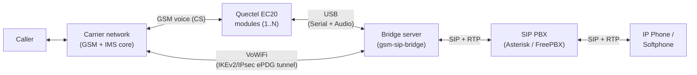
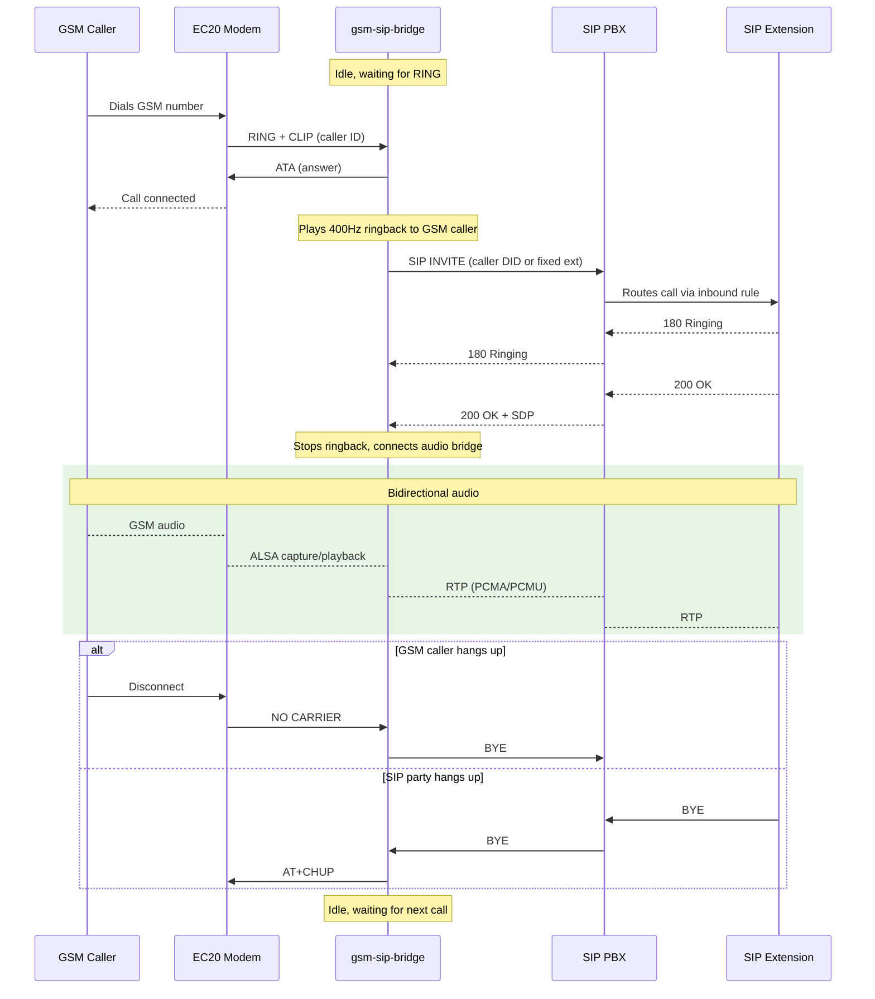
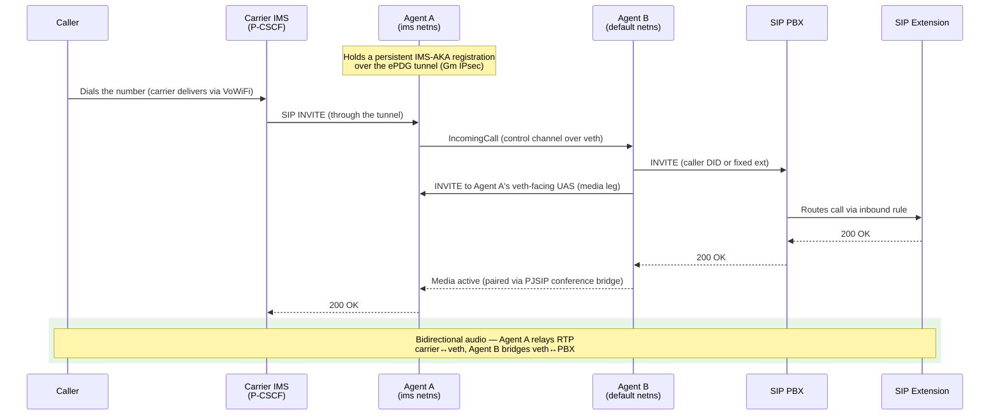
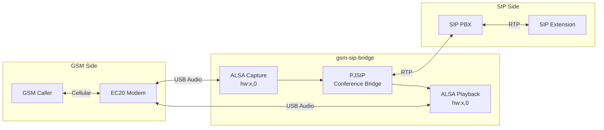

# Architecture

How the bridge is put together: the crate layout, the two inbound call
paths (circuit-switched GSM and VoWiFi), and the audio pipeline.

## The two inbound call paths

When someone dials the GSM number, the **carrier** decides how to deliver
the call. The bridge accepts it either way:

1. **Circuit-switched (CS) path** — the call arrives on a Quectel EC20
   module's cellular voice channel (2G/3G, or 4G with VoLTE enabled — see
   [ec20-volte-setup.md](ec20-volte-setup.md)). The daemon auto-answers via
   AT commands and bridges the modem's USB audio to a SIP call.
2. **VoWiFi path** — the call arrives over the carrier's IMS core through
   an IKEv2/IPsec ePDG tunnel (the same mechanism a phone uses for Wi-Fi
   Calling). Two agent processes answer it and bridge it to the same SIP
   destination. Disabled by default; see [vowifi-bridge.md](vowifi-bridge.md)
   for the full design.



## Workspace layout

Three-crate Cargo workspace:

| Crate | Role |
|---|---|
| `pjsua-sys` | Auto-generated FFI bindings to PJSIP's C `pjsua` API (via bindgen) |
| `pjsua-safe` | Safe Rust wrappers (all `unsafe` blocks carry `// SAFETY:` comments) |
| `gsm-sip-bridge` | The binary crate — zero `unsafe` |

```text
┌──────────────────────────────────────────────┐
│                  main.rs                      │
├──────────────┬──────────┬────────────────────┤
│  CardPool    │ SipBridge│   SmsHandler       │
│  (modules/)  │ (sip/)   │   (sms/)           │
├──────────────┴──────────┴────────────────────┤
│  config  │  metrics  │  store  │  runtime    │
├──────────┴───────────┴─────────┴─────────────┤
│          pjsua-safe  ←  pjsua-sys            │
└──────────────────────────────────────────────┘
```

The VoWiFi path adds two more top-level modules to the binary crate:
`ims/` (Agent A — IMS registration, Gm IPsec, RTP relay) and `vowifi/`
(Agent B — the PBX-facing PJSIP leg and the agent control channel).

## Circuit-switched call flow



The GSM caller's number is forwarded as the SIP DID via
`P-Asserted-Identity` and `X-GSM-Caller-ID` headers, so when
`[bridge].sip_destination` is empty the PBX's inbound routing rules decide
the destination.

## VoWiFi call flow

The VoWiFi leg must live inside the ePDG tunnel's `ims` network namespace;
the PBX leg needs ordinary LAN reachability from the default namespace. So
the feature is two supervised processes joined by a veth pair — **Agent A**
(`vowifi-ims-agent`, in the `ims` netns) and **Agent B** (`vowifi-sip-agent`,
in the default netns). See [vowifi-bridge.md](vowifi-bridge.md) for why, and
for the codec/wideband details.



With `[vowifi].wideband = true` (the default), a carrier's AMR-WB (16 kHz)
call stays wideband end-to-end: AMR-WB from the carrier, uncompressed
L16/16000 across the veth link, G.722 to the PBX. Narrowband carriers
(PCMU/AMR-NB) are bridged at 8 kHz exactly as before.

## Audio pipeline (CS path)



Each EC20 module has its own isolated audio pipeline. Multiple pipelines
run concurrently when multiple modules are active. Audio bridging is
handled by PJSIP's conference bridge via `pjsua_conf_connect`. While the
SIP extension is being dialed, a 400 Hz comfort ringback tone is played to
the GSM caller (via PJSIP tonegen).

Latency and audio-quality knobs (ring buffer depth, jitter buffer caps,
modem gain/echo-canceller settings) are configured under `[audio]` — see
[configuration.md](configuration.md#audio).

## Multi-card support

The system automatically detects all connected EC20 modules at startup by
scanning the USB bus for devices matching vendor/product ID `2c7c:0125`.
Each detected module:

- Receives a **stable card identifier** derived from its USB hardware
  serial number (e.g., `ec20-A1B2C3`), and a **persistent slot number**
  keyed by IMEI in the database — the same physical card always gets the
  same slot across restarts and re-plugs, even if USB enumeration order
  changes.
- Runs its own independent call-handling task with isolated serial port
  and ALSA audio.
- Can handle one GSM call at a time, bridged to SIP concurrently with
  calls on other modules.

All modules share a single SIP server registration and configuration.

### Startup behavior

- If **no modules** are found, the system waits and retries (does not exit
  immediately).
- If **some modules** fail initialization (e.g., SIM not registered), the
  system logs warnings and operates with the remaining functional modules.
- **Failed modules are retried** every 30 seconds in the background. When a
  previously failed module becomes functional, it joins the active pool
  automatically.

### Recovery

USB disconnects are detected within 5 seconds and network registration
loss within a configurable timeout. Recovery uses exponential backoff
(default 5 s → 120 s) and gives up after a configurable retry limit; each
card recovers independently. See `[resilience]` in
[configuration.md](configuration.md) and the runbook entries in
[operations.md](operations.md).

### Single-card override

When both `--serial` and `--audio` flags are provided, the system operates
in single-card mode with the specified devices, bypassing auto-detection:

```bash
gsm-sip-bridge -s /dev/ttyUSB3 -a hw:2,0 --config config.toml
```

## Further reading

- [vowifi-bridge.md](vowifi-bridge.md) — the VoWiFi bridge in depth (two-agent design, codecs, control protocol)
- [vowifi-epdg-research-notes.md](vowifi-epdg-research-notes.md) — historical engineering notes: ePDG tunnel, IMS-AKA, Gm IPsec debugging, per-carrier behavior
- [gm-ipsec-xfrm-plan.md](gm-ipsec-xfrm-plan.md) — design rationale for the kernel-XFRM Gm IPsec implementation
- `specs/` — per-feature specs, plans, and task breakdowns
