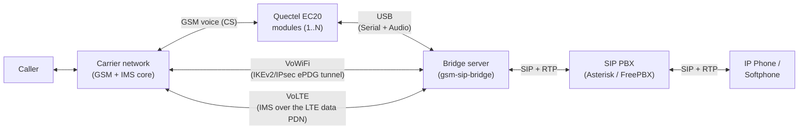
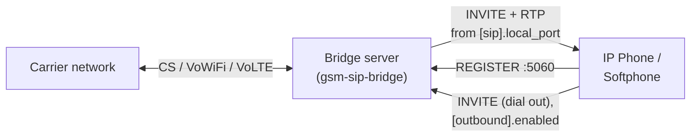
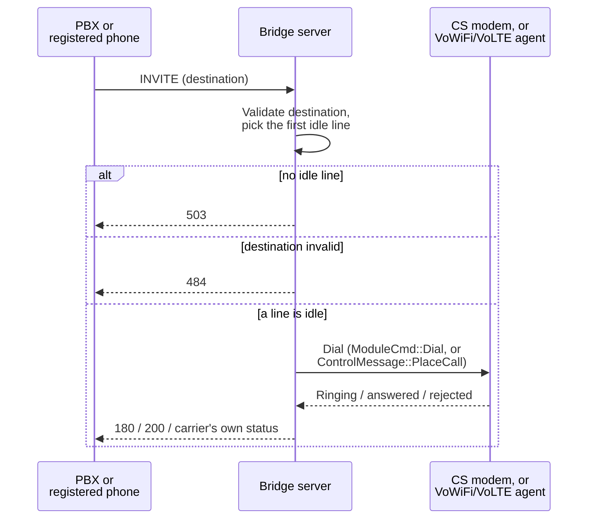
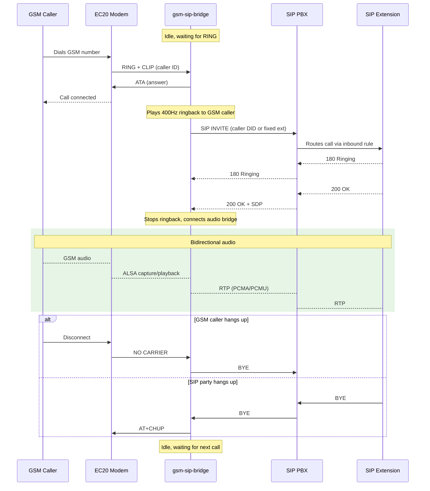
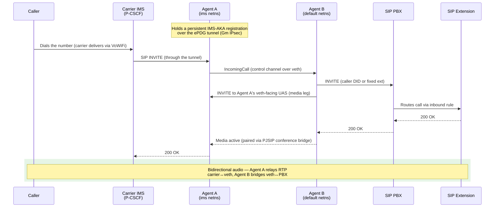
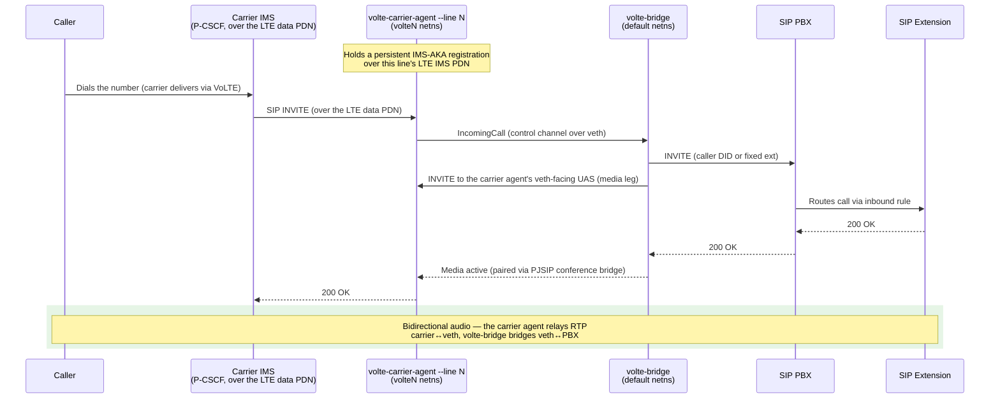
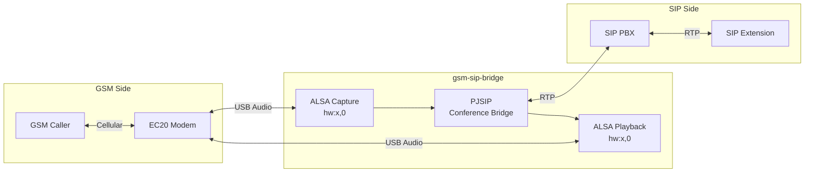

# Architecture

How the bridge is put together: the crate layout, the three inbound call
paths (circuit-switched GSM, VoWiFi, and host-side VoLTE), optional
[outbound calling](#outbound-calling), and the audio pipeline.

## The three inbound call paths

When someone dials the GSM number, the **carrier** decides how to deliver
the call. The bridge accepts it any of three ways:

1. **Circuit-switched (CS) path** — the call arrives on a Quectel EC20
   module's cellular voice channel (2G/3G, or 4G with the *modem's own*
   VoLTE stack enabled — see [ec20-volte-setup.md](ec20-volte-setup.md), a
   per-card modem setting, not the path below). The daemon auto-answers via
   AT commands and bridges the modem's USB audio to a SIP call.
2. **VoWiFi path** — the call arrives over the carrier's IMS core through
   an IKEv2/IPsec ePDG tunnel (the same mechanism a phone uses for Wi-Fi
   Calling). Two agent processes answer it and bridge it to the same SIP
   destination. Disabled by default; see [vowifi-bridge.md](vowifi-bridge.md)
   for the full design.
3. **Host-side VoLTE path** — the call arrives over the carrier's IMS core
   through the modem's LTE *data* PDN. Instead of delegating to the modem's
   internal voice stack (path 1's 4G option) and re-bridging its already
   decoded audio, the bridge runs its own IMS registration and call
   signalling — the same registration/IMS-AKA/Gm IPsec machinery the VoWiFi
   path uses, reused over a different network attachment — so codec, jitter
   handling and media stay under the bridge's control. Disabled by default;
   see the [VoLTE call flow](#volte-call-flow) below and
   [operations.md](operations.md#host-side-ims-over-lte-volte) for the
   operational reference.


```mermaid
flowchart LR
    Phone["Caller"]
    Carrier["Carrier network<br/>(GSM + IMS core)"]
    EC20["Quectel EC20<br/>modules (1..N)"]
    Server["Bridge server<br/>(gsm-sip-bridge)"]
    PBX["SIP PBX<br/>(Asterisk / FreePBX)"]
    IPPhone["IP Phone /<br/>Softphone"]

    Phone <--> Carrier
    Carrier <-->|"GSM voice (CS)"| EC20
    EC20 <-->|"USB<br/>(Serial + Audio)"| Server
    Carrier <-->|"VoWiFi<br/>(IKEv2/IPsec ePDG tunnel)"| Server
    Carrier <-->|"VoLTE<br/>(IMS over the LTE data PDN)"| Server
    Server <-->|"SIP + RTP"| PBX
    PBX <-->|"SIP + RTP"| IPPhone
```

## Two SIP-side topologies

The three paths above are about how a call *arrives*. Independently of that,
there are two ways it *leaves* — and either works with any of the three.

**With a PBX (the default).** The bridge registers to an external telephone
system as a trunk and INVITEs it. Whichever component owns the carrier side
also owns that registration: the circuit-switched daemon normally, or the
VoWiFi/VoLTE telephony agent when one of those is enabled. A trunk keeps a
single binding, so exactly one of them may hold it —
`sip::SipBridge`'s `owns_sip_side` is that decision.

**As the SIP server** (`[sip_server].enabled`, off by default,
specs/024-sip-server-mode). The bridge *is* the server: IP phones REGISTER
directly to it and inbound calls ring one configured account. No PBX exists in
the deployment at all. Intended for small sites where standing up and
maintaining a separate telephone system purely to receive the bridge's calls is
the largest part of the work.


```mermaid
flowchart LR
    Carrier["Carrier network"]
    Server["Bridge server<br/>(gsm-sip-bridge)"]
    IPPhone["IP Phone /<br/>Softphone"]

    Carrier <-->|"CS / VoWiFi / VoLTE"| Server
    IPPhone -->|"REGISTER :5060"| Server
    Server -->|"INVITE + RTP<br/>from [sip].local_port"| IPPhone
    IPPhone -->|"INVITE (dial out),<br/>[outbound].enabled"| Server
```

The registrar is pure Rust on its own UDP port, hosted in-process by whichever
component owns the SIP side — the same arbitration as the trunk case, which is
what lets one registrar serve all three call paths with no IPC. It is
deliberately *not* a PJSIP module sharing pjsua's transport: that would live
behind the `pjsip-linked` feature, which CI never compiles, so an
authentication subsystem would sit outside the test gate entirely.

Consequences worth knowing before enabling it:

- **Inbound only, unless outbound calling is enabled.** By default a phone
  cannot dial out through the mobile network — the attempt is refused with
  `403`. With `[outbound].enabled = true` (specs/025-outbound-calling), a
  registered phone's own INVITE is 302-redirected back to the bridge's own
  dial-out port instead — see [Outbound calling](#outbound-calling) below.
- **One phone rings** (inbound). Others may register but are never called.
- **Two ports.** Phones register to `[sip_server].listen_port`, but INVITEs
  are sourced from `[sip].local_port`, because two SIP endpoints cannot share
  one UDP socket. RFC-correct — delivery uses the phone's own `Contact` — but
  see [operations.md](operations.md#sip-server-mode) for the one handset
  setting that interacts with it.

## Outbound calling

`[outbound].enabled` (off by default, specs/025-outbound-calling) lets the
bridge dial the mobile network on request, instead of only ever answering
it. Two things can trigger a dial-out:

- **A PBX INVITE** to the bridge's trunk account — the normal case with a
  PBX in front.
- **A registered phone's own INVITE**, in SIP server mode — the registrar
  302-redirects it back to the bridge's dial-out port (see
  [Two SIP-side topologies](#two-sip-side-topologies) above) rather than
  refusing it with `403`.

Either way, the destination is the Request-URI's user part, dialed
verbatim — no allow-list, no rewriting.


```mermaid
sequenceDiagram
    participant Caller as PBX or<br/>registered phone
    participant Server as Bridge server
    participant Line as CS modem, or<br/>VoWiFi/VoLTE agent

    Caller->>Server: INVITE (destination)
    Server->>Server: Validate destination,<br/>pick the first idle line
    alt no idle line
        Server-->>Caller: 503
    else destination invalid
        Server-->>Caller: 484
    else a line is idle
        Server->>Line: Dial (ModuleCmd::Dial, or<br/>ControlMessage::PlaceCall)
        Line-->>Server: Ringing / answered / rejected
        Server-->>Caller: 180 / 200 / carrier's own status
    end
```

**Line selection**: whichever line is idle, first-idle-wins, no path
preference — the circuit-switched daemon (`CardPool`) and the VoWiFi/VoLTE
process (`vowifi::mod`) each own an independent pool of lines in their own
process and only ever select from it. There is no cross-process fallback:
whichever process actually received the INVITE is the only one that gets a
shot at placing the call — if every line in *its* pool is busy, the call is
refused even if the other process has an idle line. (An earlier design
explored a cross-process line-selection channel for this; it was dropped —
no cross-process audio bridge exists for the circuit-switched case, and
building one was judged out of proportion to the gap it would close. See
`specs/025-outbound-calling/data-model.md` and
`contracts/line-command.md`'s superseded banner for the full reasoning.)

**Known limitations**: call progress for the circuit-switched path is
coarse — `ATD`'s own response only confirms the attempt started, not
whether the destination actually answered, so a CS-originated call is
accepted (`200`) once dialing is confirmed, not once truly answered. The
VoWiFi/VoLTE path relays real carrier progress (`180 Ringing`, and the
carrier's own rejection code on failure), but blocks its own dispatch loop
for up to ~80 seconds while a call is in flight, during which a caller
hanging up mid-ring can't trigger a CANCEL and an unrelated inbound call is
effectively dropped. See `docs/todo.md` for both, and
`specs/025-outbound-calling/tasks.md`'s code-review sections for the full
history.

## Workspace layout

Three-crate Cargo workspace:

| Crate | Role |
|---|---|
| `pjsua-sys` | Auto-generated FFI bindings to PJSIP's C `pjsua` API (via bindgen) |
| `pjsua-safe` | Safe Rust wrappers (all `unsafe` blocks carry `// SAFETY:` comments) |
| `gsm-sip-bridge` | The binary crate — zero `unsafe` |

```text
┌──────────────────────────────────────────────┐
│      main.rs  →  commands/  (CLI + daemon)   │
├──────────────┬──────────┬────────────────────┤
│  CardPool    │ SipBridge│   SmsHandler       │
│  (modules/)  │ (sip/)   │   (sms/)           │
├──────────────┴──────────┴────────────────────┤
│  config  │  metrics  │  store  │  runtime    │
├──────────┴───────────┴─────────┴─────────────┤
│          pjsua-safe  ←  pjsua-sys            │
└──────────────────────────────────────────────┘
```

`main.rs` is deliberately thin — argument parsing, logging setup, and a
dispatch call. Every subcommand handler lives in `commands/` (one module per
family, plus `commands::daemon` for the no-subcommand default) *inside the
library*, because items in a binary crate cannot be imported from `tests/`
and so cannot be tested at all.

The VoWiFi and VoLTE paths add three more top-level modules to the binary
crate: `ims/` (IMS registration, IMS-AKA, Gm IPsec, RTP relay — shared
machinery behind an `ImsTransport` trait, so the registration/signalling
code is written once and driven over either network attachment), `vowifi/`
(the ePDG-tunnel transport, plus Agent B — the PBX-facing PJSIP leg and
agent control channel), and `volte/` (the LTE-data-PDN transport, plus the
per-line carrier agent and PBX-facing bridge — see
[VoLTE call flow](#volte-call-flow) below).

## Circuit-switched call flow


```mermaid
sequenceDiagram
    participant Caller as GSM Caller
    participant EC20 as EC20 Modem
    participant Bridge as gsm-sip-bridge
    participant PBX as SIP PBX
    participant Ext as SIP Extension

    Note over Bridge: Idle, waiting for RING

    Caller->>EC20: Dials GSM number
    EC20->>Bridge: RING + CLIP (caller ID)
    Bridge->>EC20: ATA (answer)
    EC20-->>Caller: Call connected

    Note over Bridge: Plays 400Hz ringback to GSM caller

    Bridge->>PBX: SIP INVITE (caller DID or fixed ext)
    PBX->>Ext: Routes call via inbound rule
    Ext-->>PBX: 180 Ringing
    PBX-->>Bridge: 180 Ringing
    Ext-->>PBX: 200 OK
    PBX-->>Bridge: 200 OK + SDP

    Note over Bridge: Stops ringback, connects audio bridge

    rect rgb(230, 245, 230)
        Note over Caller, Ext: Bidirectional audio
        Caller-->EC20: GSM audio
        EC20-->Bridge: ALSA capture/playback
        Bridge-->PBX: RTP (PCMA/PCMU)
        PBX-->Ext: RTP
    end

    alt GSM caller hangs up
        Caller->>EC20: Disconnect
        EC20->>Bridge: NO CARRIER
        Bridge->>PBX: BYE
    else SIP party hangs up
        Ext->>PBX: BYE
        PBX->>Bridge: BYE
        Bridge->>EC20: AT+CHUP
    end

    Note over Bridge: Idle, waiting for next call
```

The GSM caller's number is forwarded as the SIP DID via
`P-Asserted-Identity` and `X-GSM-Caller-ID` headers, so when
`[bridge].sip_destination` is empty the PBX's inbound routing rules decide
the destination.

## VoWiFi call flow

The VoWiFi leg must live inside the ePDG tunnel's `ims` network namespace;
the PBX leg needs ordinary LAN reachability from the default namespace. So
the feature is two supervised processes joined by a veth pair — **Agent A**
(`vowifi-ims-agent`, in the `ims` netns) and **Agent B** (`vowifi-sip-agent`,
in the default netns). See [vowifi-bridge.md](vowifi-bridge.md) for why, and
for the codec/wideband details.


```mermaid
sequenceDiagram
    participant Caller
    participant IMS as Carrier IMS<br/>(P-CSCF)
    participant A as Agent A<br/>(ims netns)
    participant B as Agent B<br/>(default netns)
    participant PBX as SIP PBX
    participant Ext as SIP Extension

    Note over A: Holds a persistent IMS-AKA registration<br/>over the ePDG tunnel (Gm IPsec)

    Caller->>IMS: Dials the number (carrier delivers via VoWiFi)
    IMS->>A: SIP INVITE (through the tunnel)
    A->>B: IncomingCall (control channel over veth)
    B->>PBX: INVITE (caller DID or fixed ext)
    B->>A: INVITE to Agent A's veth-facing UAS (media leg)
    PBX->>Ext: Routes call via inbound rule
    Ext-->>PBX: 200 OK
    PBX-->>B: 200 OK
    B-->>A: Media active (paired via PJSIP conference bridge)
    A-->>IMS: 200 OK

    rect rgb(230, 245, 230)
        Note over Caller, Ext: Bidirectional audio — Agent A relays RTP<br/>carrier↔veth, Agent B bridges veth↔PBX
    end
```

With `[vowifi].wideband = true` (the default), a carrier's AMR-WB (16 kHz)
call stays wideband end-to-end: AMR-WB from the carrier, uncompressed
L16/16000 across the veth link, G.722 to the PBX. Narrowband carriers
(PCMU/AMR-NB) are bridged at 8 kHz exactly as before.

## VoLTE call flow

Structurally this mirrors the [VoWiFi call flow](#vowifi-call-flow) above —
the same registration/IMS-AKA/Gm IPsec machinery behind `ImsTransport`, and
the same "carrier-facing half in its own namespace, PBX-facing half shared"
split — generalized to *N* lines instead of two fixed agents. See
[operations.md](operations.md#host-side-ims-over-lte-volte) for config, CLI
verbs, and the standalone diagnostic subcommands (`volte-discover`,
`volte-register`, `volte-call`, `volte-status`) that predate call bridging.

**Per-line carrier agent** (`volte-carrier-agent --line N`,
`specs/020-volte-line-netns`) runs inside that line's own network namespace
(`volteN`), one process per LTE modem: attaches that modem's IMS PDN, holds
the IMS-AKA registration, and answers calls on it. **Shared PBX bridge**
(`volte-bridge`) runs once in the default namespace, holds the single SIP
registration to the PBX, and relays each line's call over a veth pair to its
carrier agent — reusing the exact `run_telephony_side`/`RuntimeLine` code
path VoWiFi's Agent B uses, so a VoLTE line's traffic cannot egress via
another line's LTE interface (closing the isolation gap the earlier
single-namespace multi-modem design, `specs/018-volte-multi-modem`, left
open).


```mermaid
sequenceDiagram
    participant Caller
    participant IMS as Carrier IMS<br/>(P-CSCF, over the LTE data PDN)
    participant CA as volte-carrier-agent --line N<br/>(volteN netns)
    participant VB as volte-bridge<br/>(default netns)
    participant PBX as SIP PBX
    participant Ext as SIP Extension

    Note over CA: Holds a persistent IMS-AKA registration<br/>over this line's LTE IMS PDN

    Caller->>IMS: Dials the number (carrier delivers via VoLTE)
    IMS->>CA: SIP INVITE (over the LTE data PDN)
    CA->>VB: IncomingCall (control channel over veth)
    VB->>PBX: INVITE (caller DID or fixed ext)
    VB->>CA: INVITE to the carrier agent's veth-facing UAS (media leg)
    PBX->>Ext: Routes call via inbound rule
    Ext-->>PBX: 200 OK
    PBX-->>VB: 200 OK
    VB-->>CA: Media active (paired via PJSIP conference bridge)
    CA-->>IMS: 200 OK

    rect rgb(230, 245, 230)
        Note over Caller, Ext: Bidirectional audio — the carrier agent relays RTP<br/>carrier↔veth, volte-bridge bridges veth↔PBX
    end
```

Up to `[volte].max_lines` (default 8) LTE modems run concurrently this way,
each with its own registration and namespace but one shared PBX registration
— matching VoWiFi's multi-line model (`specs/013-multi-card-vowifi`).
Incoming SMS on a VoLTE line is read from modem storage and recorded the same
way as the CS and VoWiFi paths (`transport="volte"` in the `calls`/`sms`
tables and on the `gsm_sip_bridge_active_calls` metric). A card bridged this
way is exclusive to VoLTE — the circuit-switched daemon will not also drive
it — and each line handles one call at a time, refusing a second as busy.

This differs from [ec20-volte-setup.md](ec20-volte-setup.md)'s modem-internal
VoLTE only in *whose* IMS stack does the work: that page's setting makes the
CS path (path 1 above) carry voice over 4G through the modem's own IMS
client. This path bypasses the modem's IMS client entirely and is a fully
independent inbound path, on par with VoWiFi — and, like VoWiFi, the two
cannot both register the same SIM at once; see
[operations.md](operations.md#never-enable-vowifi-and-volte-on-the-same-sim).

## Audio pipeline (CS path)


```mermaid
flowchart LR
    subgraph GSM["GSM Side"]
        A[GSM Caller] <-->|Cellular| B[EC20 Modem]
    end

    subgraph Bridge["gsm-sip-bridge"]
        direction TB
        C[ALSA Capture<br/>hw:x,0] --> E[PJSIP<br/>Conference Bridge]
        E --> H[ALSA Playback<br/>hw:x,0]
    end

    subgraph SIP["SIP Side"]
        I[SIP PBX] <-->|RTP| J[SIP Extension]
    end

    B <-->|USB Audio| C
    B <-->|USB Audio| H
    E <-->|RTP| I
```

Each EC20 module has its own isolated audio pipeline. Multiple pipelines
run concurrently when multiple modules are active. Audio bridging is
handled by PJSIP's conference bridge via `pjsua_conf_connect`. While the
SIP extension is being dialed, a 400 Hz comfort ringback tone is played to
the GSM caller (via PJSIP tonegen).

Latency and audio-quality knobs (ring buffer depth, jitter buffer caps,
modem gain/echo-canceller settings) are configured under `[audio]` — see
[configuration.md](configuration.md#audio).

## Multi-card support

The system automatically detects all connected EC20 modules at startup by
scanning the USB bus for devices matching vendor/product ID `2c7c:0125`.
Each detected module:

- Receives a **stable card identifier** derived from its USB hardware
  serial number (e.g., `ec20-A1B2C3`), and a **persistent slot number**
  keyed by IMEI in the database — the same physical card always gets the
  same slot across restarts and re-plugs, even if USB enumeration order
  changes.
- Runs its own independent call-handling task with isolated serial port
  and ALSA audio.
- Can handle one GSM call at a time, bridged to SIP concurrently with
  calls on other modules.

All modules share a single SIP server registration and configuration.

### Startup behavior

- If **no modules** are found, the system waits and retries (does not exit
  immediately).
- If **some modules** fail initialization (e.g., SIM not registered), the
  system logs warnings and operates with the remaining functional modules.
- **Failed modules are retried** every 30 seconds in the background. When a
  previously failed module becomes functional, it joins the active pool
  automatically.

### Recovery

USB disconnects are detected within 5 seconds and network registration
loss within a configurable timeout. Recovery uses exponential backoff
(default 5 s → 120 s) and gives up after a configurable retry limit; each
card recovers independently. See `[resilience]` in
[configuration.md](configuration.md) and the runbook entries in
[operations.md](operations.md).

### Single-card override

When both `--serial` and `--audio` flags are provided, the system operates
in single-card mode with the specified devices, bypassing auto-detection:

```bash
gsm-sip-bridge -s /dev/ttyUSB3 -a hw:2,0 --config config.toml
```

## Further reading

- [vowifi-bridge.md](vowifi-bridge.md) — the VoWiFi bridge in depth (two-agent design, codecs, control protocol)
- [operations.md](operations.md#host-side-ims-over-lte-volte) — the VoLTE bridge in depth (config, CLI verbs, metrics, troubleshooting)
- [vowifi-epdg-research-notes.md](vowifi-epdg-research-notes.md) — historical engineering notes: ePDG tunnel, IMS-AKA, Gm IPsec debugging, per-carrier behavior
- [gm-ipsec-xfrm-plan.md](gm-ipsec-xfrm-plan.md) — design rationale for the kernel-XFRM Gm IPsec implementation
- `specs/` — per-feature specs, plans, and task breakdowns; VoLTE spans `015-volte-host-ims` through `020-volte-line-netns`
