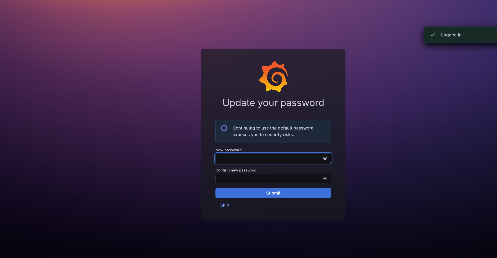

# Observability

Prometheus metrics, the Grafana dashboard, and what gets persisted to the
call/SMS database.

## Metrics endpoint

Prometheus-compatible metrics are served at `http://<host>:9091/metrics`
(port configurable via `[metrics].port`).

| Metric | Type | Description |
|---|---|---|
| `gsm_sip_bridge_calls_total` | Counter | GSM calls by module and status |
| `gsm_sip_bridge_sip_calls_total` | Counter | Outbound SIP calls by module and status |
| `gsm_sip_bridge_call_duration_seconds` | Histogram | Call duration distribution (1s to 30min buckets) |
| `gsm_sip_bridge_active_calls` | Gauge | Currently active bridged calls per module |
| `gsm_sip_bridge_sip_registrations_total` | Counter | SIP registration attempts by status |
| `gsm_sip_bridge_sip_registered` | Gauge | SIP registration state (1=registered, 0=unregistered) |
| `gsm_sip_bridge_module_init_total` | Counter | Module initialization attempts by status |
| `gsm_sip_bridge_module_retries_total` | Counter | Module retry attempts |
| `gsm_sip_bridge_modules_active` | Gauge | Number of active modules |
| `gsm_sip_bridge_modules_failed` | Gauge | Number of failed modules pending retry |
| `gsm_sip_bridge_audio_errors_total` | Counter | Audio errors by module and type |
| `gsm_sip_bridge_sms_received_total` | Counter | SMS messages received per module |
| `gsm_sip_bridge_sms_forwarded_total` | Counter | Discord forwarding outcomes per module |
| `gsm_sip_bridge_sms_db_writes_total` | Counter | SMS database write outcomes |
| `gsm_sip_bridge_store_writes_total` | Counter | All store writes by table and outcome |
| `gsm_sip_bridge_store_queue_depth` | Gauge | Pending items for DB writer thread |
| `gsm_sip_bridge_uptime_seconds` | Gauge | Process uptime in seconds |
| `gsm_sip_bridge_build_info` | Gauge | Build metadata (version, git SHA) |

## Grafana dashboard

The "GSM-SIP Bridge" dashboard is auto-provisioned on first boot of the
Docker Compose stack (credentials: `admin` / `admin`).

Dashboard panels include:

- System overview (SIP registration, active modules, uptime, call counts)
- GSM and SIP call rates over time
- Active calls per module
- Call duration percentiles (p50/p95/p99)
- SIP registration state timeline
- Module health and retry counts
- Audio and SIP error rates
- SMS forwarding success/failure rates

## Call and SMS database

All incoming calls and SMS messages are persisted to the SQLite database
(WAL mode for concurrent access). In the Docker Compose stack, sqlite-web
serves a read-only browser for it at `http://localhost:8088`. For direct
`sqlite3` queries, pruning, and backup recipes see
[operations.md](operations.md).

**Calls table**:

| Column | Description |
|---|---|
| `module_id` | Card identifier (e.g., `ec20-A1B2C3`) |
| `caller_id` | GSM caller's phone number |
| `started_at` | ISO 8601 timestamp (UTC) |
| `duration_seconds` | Call duration in seconds (0.0 for missed calls) |
| `status` | `answered`, `missed`, or `failed` |
| `sip_destination` | SIP extension dialed (empty for missed calls) |

**SMS table**:

| Column | Description |
|---|---|
| `module_id` | Card identifier |
| `sender` | SMS sender number |
| `body` | Message text |
| `received_at` | ISO 8601 timestamp (UTC) |
| `forwarding_status` | `pending`, `sent`, `failed`, or `skipped` |

**card_slots table** (IMEI→slot mapping, persisted across restarts):

| Column | Description |
|---|---|
| `slot` | Slot index (0-based, stable for the life of the hardware) |
| `imei` | 15-digit IMEI uniquely identifying the physical modem |
| `assigned_at` | ISO 8601 timestamp when the slot was first assigned |

**card_mode_prefs table** (per-slot network mode preference):

| Column | Description |
|---|---|
| `slot` | Slot index |
| `mode` | Network mode: `auto`, `2g`, `3g`, or `4g` |
| `updated_at` | ISO 8601 timestamp of the last `card set-mode` call |
